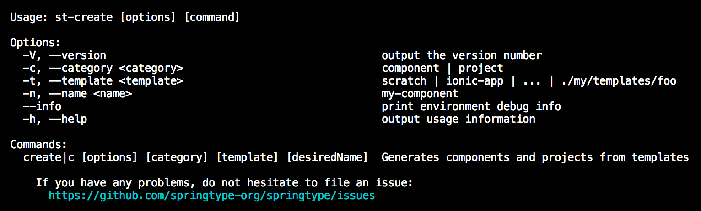

<h1 align="center">st-create</h1>

The missing TypeScript project scaffolder

> Generates whole TypeScript projects with a single line of code

<h2 align="center">Try it</h2>

    npx st-create

The following command prints all options:

    st-create -h

<h2 align="center">Automation</h2>

Instead of the interactive CLI questionair, you can also name all agruments and directly generate results:

    st-create -t parcel -d HelloWorld

<h2 align="center">Custom templates</h2>

You can just name a template folder to create a new project:

    st-create -t ../templates/my-blog-template -d AronsBlog

OR

    st-create -t https://github.com/springtype-org/st-template-parcel -d ParcelBasedProject

<h2 align="center">Maintainers</h2>

<table>
  <tbody>
    <tr>
      <td align="center">
        
         
        <a href="https://github.com/kyr0">Aron Homberg</a>
      </td>
      <td align="center">
        
         
        <a href="https://github.com/mansi1">Michael Mannseicher</a>
      </td>
    </tr>
  <tbody>
</table>

<h2 align="center">Contributing</h2>

Please help out to make this project even better and see your name added to the list of our  
[CONTRIBUTORS.md](./CONTRIBUTORS.md) :tada: