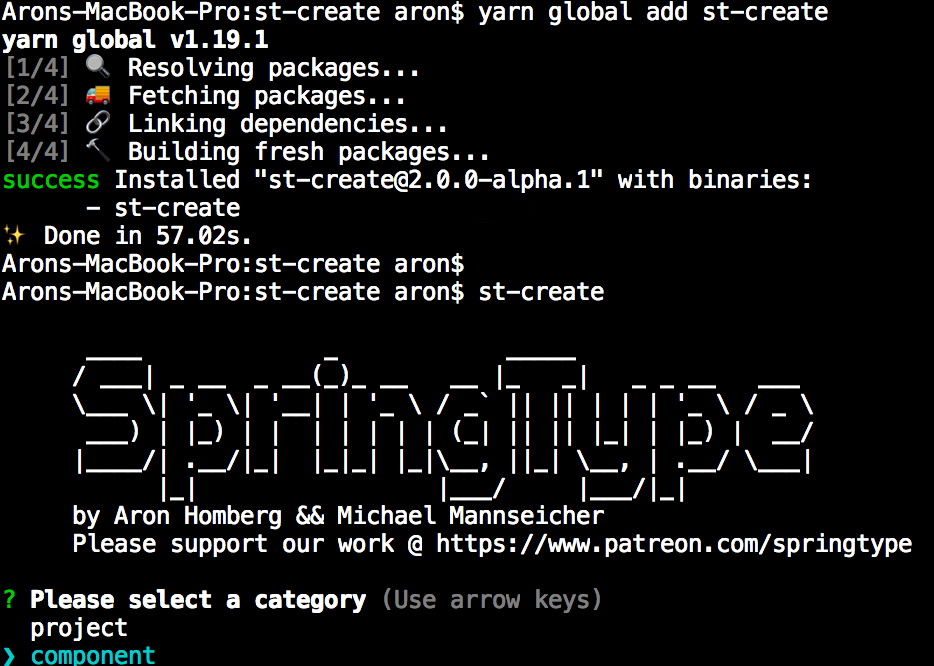

<h1 align="center">st-create</h1>

The nano project scaffolder

> Generates projects in just 1 line of code

<h2 align="center">Try it</h2>

    npx st-create

The following command prints all options:

    st-create -h

<h2 align="center">Custom templates</h2>

You can create a new project from a template folder (e.g. created by yourself):

    st-create -t ../templates/my-blog-template -n AronsNewBlog

Or even clone an arbitrary Git project:

    st-create -t https://github.com/springtype-org/st-template-parcel -n MyNewParcelBasedProject

<h2 align="center">Template language</h2>

The following substritutions will happen for templates:

- `templateName` 
- `template-name`
- `TemplateName`

...will be transformed in the projects name (e.g. MyNewParcelBasedProject) keeping the original casing.

This works for both *file names* and occurances in *file contents* inside of the template folder/git repository.

<h2 align="center">Maintainers</h2>

<table>
  <tbody>
    <tr>
      <td align="center">
        
         
        <a href="https://github.com/kyr0">Aron Homberg</a>
      </td>
      <td align="center">
        
         
        <a href="https://github.com/mansi1">Michael Mannseicher</a>
      </td>
    </tr>
  <tbody>
</table>

<h2 align="center">Contributing</h2>

Please help out to make this project even better and see your name added to the list of our  
[CONTRIBUTORS.md](./CONTRIBUTORS.md) :tada: